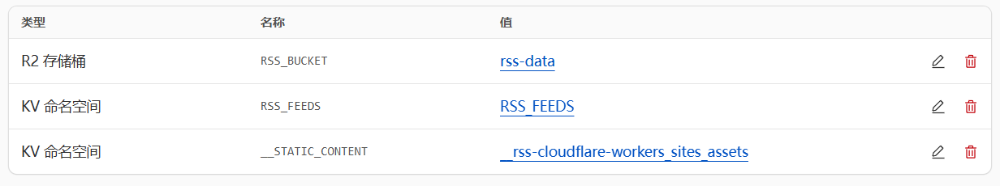

# RSS订阅服务


基于 Cloudflare Workers 构建的轻量级 RSS 订阅服务，支持 GitHub 账号登录和订阅源管理。

## ✨ 特性

- 🚀 基于 Cloudflare Workers，快速且可靠
- 🔐 GitHub OAuth 认证
- 📱 响应式设计，支持移动端
- 🌓 自动深色模式
- 📊 分页显示
- 🔍 作者筛选
- 💾 R2 存储支持
- 🔄 实时内容更新

## 🛠️ 技术栈

- [Cloudflare Workers](https://workers.cloudflare.com/) - 边缘计算平台
- [Hono](https://hono.dev/) - 轻量级 Web 框架
- [TypeScript](https://www.typescriptlang.org/) - 类型安全
- [GitHub OAuth](https://docs.github.com/en/apps/oauth-apps) - 用户认证
- [Cloudflare R2](https://www.cloudflare.com/products/r2/) - 对象存储

## 📦 部署

1. Fork 本仓库

2. 在Cloudflare新建Workers

3. 配置环境变量
```env
GITHUB_CLIENT_ID=your_github_client_id
GITHUB_CLIENT_SECRET=your_github_client_secret
ALLOWED_GITHUB_USERS=user1,user2
APP_URL=your_app_url
```

4. 配置绑定



5. 配置定时任务

## 🔧 配置说明

### GitHub OAuth 配置

1. 在 GitHub 创建一个新的 OAuth 应用
2. 设置回调 URL：`https://your-worker-url/auth/github/callback`
3. 获取 Client ID 和 Client Secret
4. 在 Cloudflare Workers 设置环境变量

### R2 存储配置

1. 在 Cloudflare R2 创建一个新的存储桶
2. 配置 Workers 绑定
3. 更新 wrangler.toml 配置

## 📝 API 文档

### 公开 API

- `GET /api/rss/public` - 获取所有 RSS 内容
- `GET /api/rss/public?author=xxx` - 按作者筛选内容

### 认证 API

- `GET /api/feeds` - 获取订阅源列表
- `POST /api/feeds` - 添加新订阅源
- `DELETE /api/feeds/:url` - 删除订阅源
- `GET /api/rss` - 获取 RSS 内容
- `POST /api/rss/refresh` - 刷新 RSS 内容

## 🤝 贡献

欢迎提交 Issue 和 Pull Request！

## 📄 许可证

[MIT License](LICENSE) 